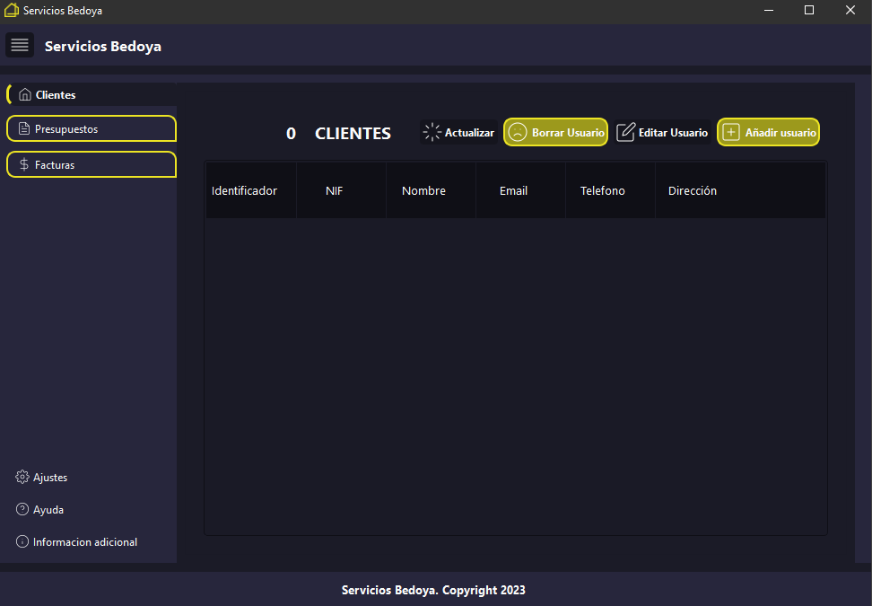
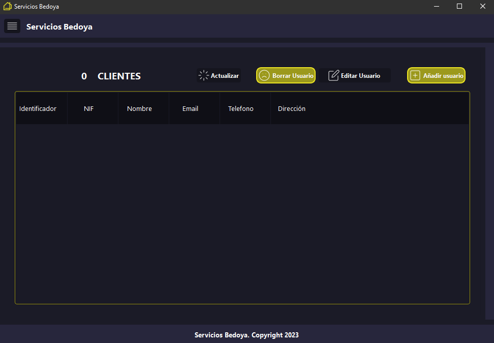
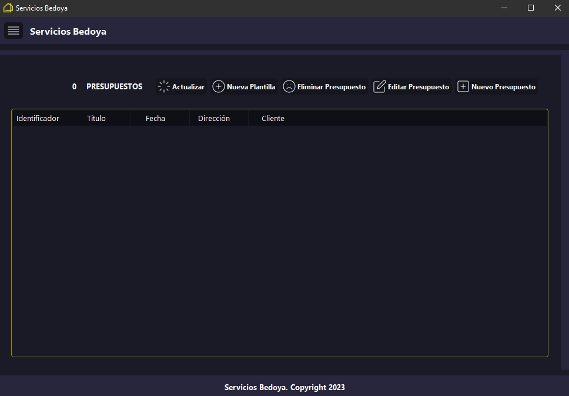

# BudgetInvoiceApp2.0
Project to automate the generation of budgets and invoices

## Requirements

* Python3
* PySide6
* (all requirements at the requirements.txt file)

### Command to generate .gitignore
```
curl -o .gitignore https://raw.githubusercontent.com/github/gitignore/master/Python.gitignore
```

## Initial/Clients Window
### This is the initial window, it shows the clients

### This window shows all clients in the system and the number of them. They can be added, edited and deleted.


## Budgets window
### This window shows all budgets in the system and the number of them. They can be added, edited and deleted.
